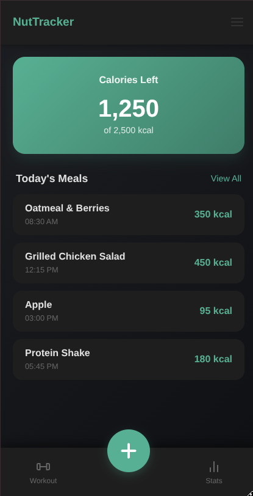
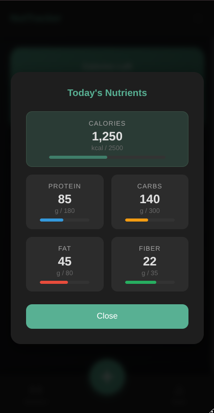
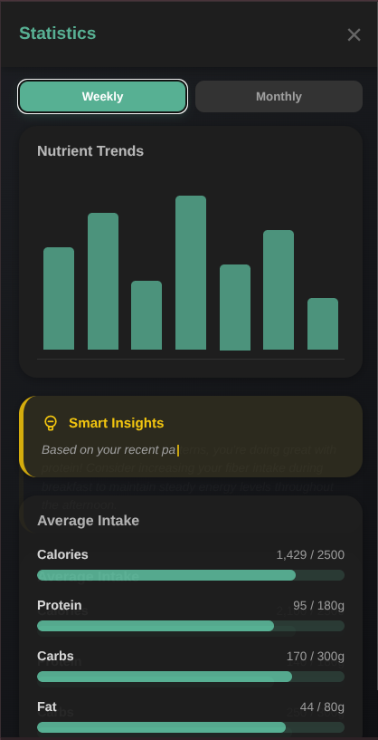

# NutriTrack

A comprehensive nutrition and meal tracking application built with **Flask**, **SQLAlchemy**, and a modern **Vanilla JS** frontend.

## Features
- **Daily Tracking:** Log meals and track your calorie and macro intake.
- **Statistics Dashboard:** View weekly and monthly trends of your nutritional habits.
- **PWA Ready:** Install the app on your mobile device for easy access.
- **Dark Mode Support:** Modern UI that adapts to your system preferences.

## 📱 App Preview

| Home Screen | Today's Log | Statistics |
| :---: | :---: | :---: |
|  |  |  |

## Getting Started

Follow these instructions to set up and run the application on your local machine.

### Prerequisites
- Python 3.10 or higher

### Installation
1.  **Clone the repository:**
    ```bash
    git clone https://github.com/looser-xxx/nutriTracker.git
    cd nutriTracker
    ```
2.  **Create a virtual environment:**
    ```bash
    python3 -m venv venv
    ```
3.  **Activate the virtual environment:**
    - On Linux/macOS: `source venv/bin/activate`
    - On Windows: `venv\Scripts\activate`
4.  **Install dependencies:**
    ```bash
    pip install -r requirements.txt
    ```

### Running the Application
1.  **Start the Flask server:**
    ```bash
    python3 app.py
    ```
2.  **Access the application:**
    The application will be running at `http://127.0.0.1:5000/`.

## API Endpoints

### Food Management
- `POST /api/dataBase/admin/addFood`: Admin tool to add items to the directory.
- `GET /api/dataBase/directory`: List all food items in the database.

### Meal Logging
- `POST /api/logs/logMeal`: Log a meal (expects `foodId` and `amountInG`).
- `GET /api/logs/nutritionConsumed/<int:id>`: Get detailed nutrition for a specific log entry.
- `DELETE /api/logs/today/delete/<int:id>`: Remove a meal log by its ID.

### Tracking & Statistics
- `GET /api/logs/today/allLogs`: Get a list of all meals consumed today.
- `GET /api/logs/today/totalNutriConsumed`: Get the sum of all nutrients consumed today (Calories, Protein, Carbs, Fat, Fiber).
- `GET /api/logs/avg/<int:days>`: Get average nutritional intake and graph data for the last *X* days (e.g., 7 for weekly, 30 for monthly).
